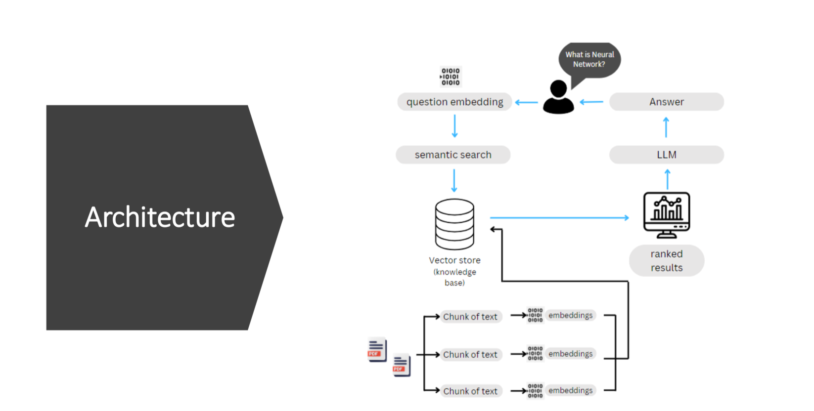

# AI Chatbot with Retrieval-Augmented Generation (RAG)

An AI-powered PDF-based chatbot that uses Retrieval-Augmented Generation (RAG) to answer user questions based on uploaded documents.

## 🚀 Live Demo

[👉 Try the AI Chatbot](https://ad3x-aichatbot-iy7fwgvvkepcvtrxh3hzt8.streamlit.app/)

## 🏗️ Architecture

The application follows a Retrieval-Augmented Generation architecture where documents are processed, converted into embeddings, stored in a vector database, and retrieved based on the user's query.



### Workflow

1. **PDF Documents** – User uploads PDF documents.
2. **Text Extraction** – Text is extracted from the documents.
3. **Text Chunking** – Documents are divided into smaller chunks.
4. **Embeddings** – Text chunks are converted into vector embeddings.
5. **Vector Store** – Embeddings are stored in FAISS.
6. **Question Embedding** – The user's question is converted into an embedding.
7. **Semantic Search** – FAISS retrieves the most relevant document chunks.
8. **LLM** – Retrieved context is provided to the language model.
9. **Answer** – The LLM generates the final response based on the retrieved context.

### Architecture Flow

```text
PDF Documents
      ↓
Text Extraction
      ↓
Text Chunking
      ↓
Embeddings
      ↓
FAISS Vector Store
      ↓
User Question
      ↓
Question Embedding
      ↓
Semantic Search
      ↓
Relevant Context
      ↓
LLM
      ↓
Final Answer